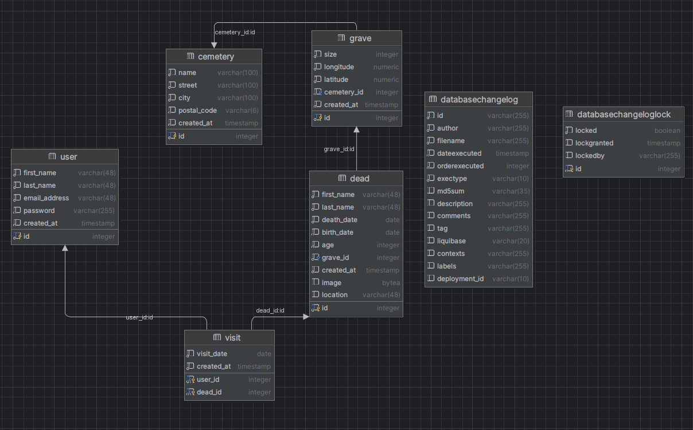
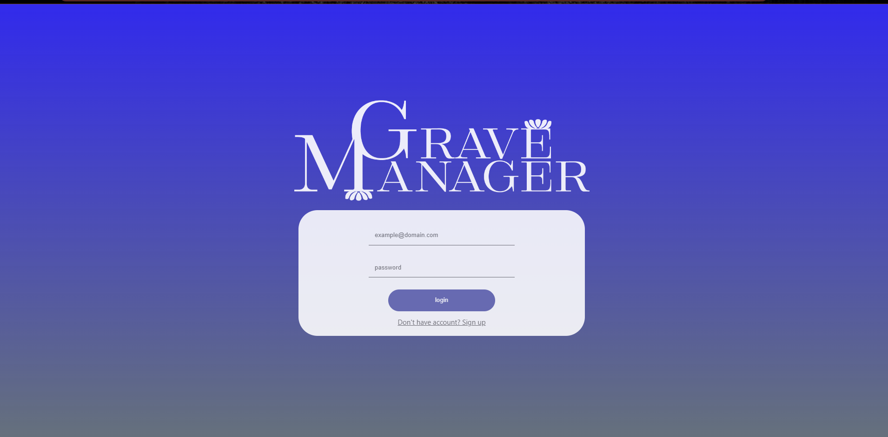
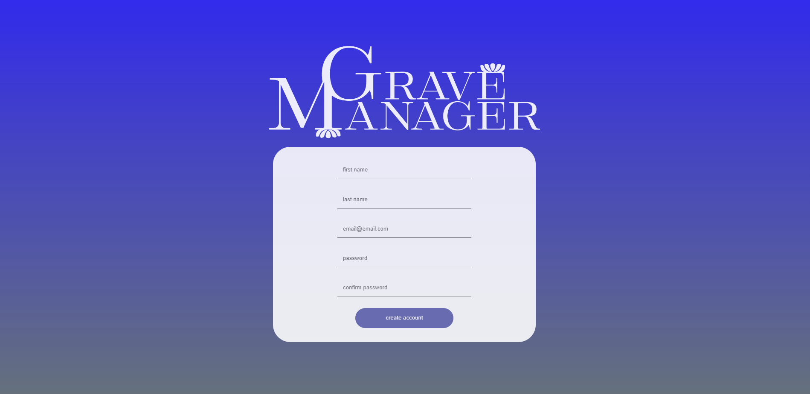
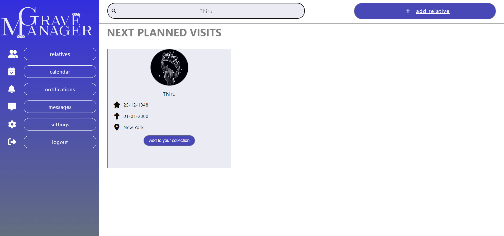
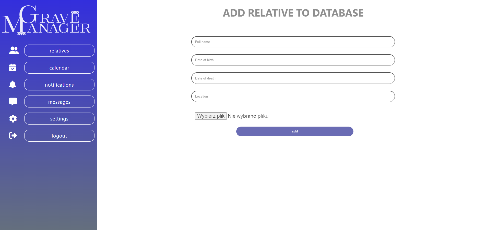
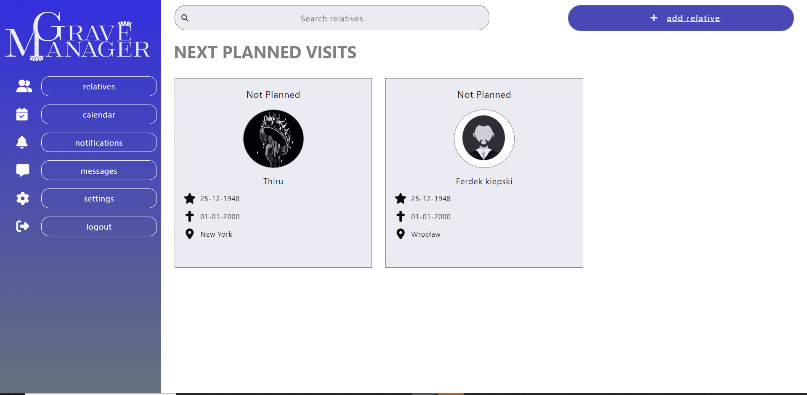

# Grave Manager

Grave Manager is a comprehensive solution designed to manage and maintain records of graves, ensuring efficient management of cemeteries.

## Modules

- **Backend Service**: Manages the data, API calls, and business logic. [Read More](./backend-service/README.md)
- **UI Service**: Provides a user-friendly interface for interaction. [Read More](./ui-service/README.md)

## Getting Started

To get the entire Grave Manager solution up and running, follow the setup instructions in the README files for both the:
- [Backend Service](./backend-service/README.md) 
- [UI Service](./ui-service/README.md)

## Contributing

We welcome contributions to any part of the Grave Manager! Please ensure you read the README and contributing guidelines in each module/service you're interested in.

## Contact

For queries or feedback, reach out to us at `support@gravemanager.com`.


### Installation

1. Clone the repository:
   ```sh
   git clone https://github.com/your-username/GraveManager.git

## Run-infrastructure-locally

The infrastructure for grave-manager consist of:
- PostgresDB

1. Use the following command from the root folder to setup required infrastructure:
```shell
docker-compose up -d
```

## Branching strategy
Project was started on studies for laboratories called Manufacturing of Advanced Web Applications.

One of the requirements was to have all services in one git repository therefore branching strategy is introduced.

Repository have restricted branching convention:
 - for changes in backend-service please create new branch with use of **"BS-*"** at the begging. 
 - for changes in ui-service please create new branch with use of **"UI-*"** at the begging.
 - for changes in root grave-manager create new branch with use of **"GM-*"** at the begging.

Please for repo visibility do not mix changes between mentioned above folders.

## Features
* Responsive design for optimal user experience across devices
* Registration and login
* User session and logout
* Simple adding of new grave information to db
* Searching of the entire database and adding to a user's own collection
* Visit Planning

## Database Diagram


## Example of views from app

### Login


### Registration


### Searching


### Adding to db


### View of user relatives collection

