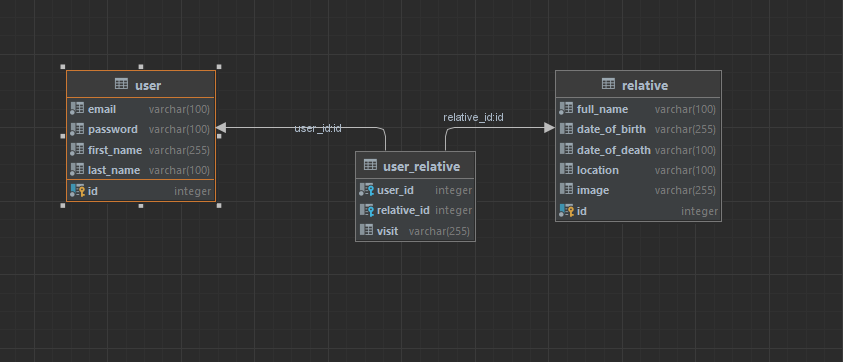
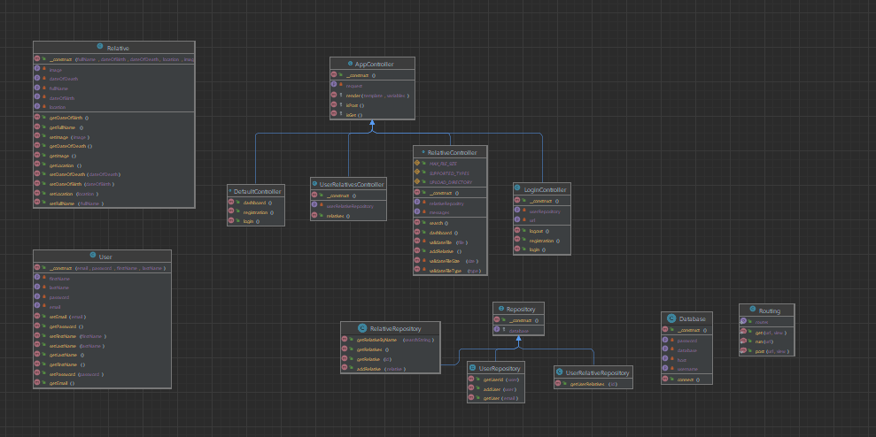
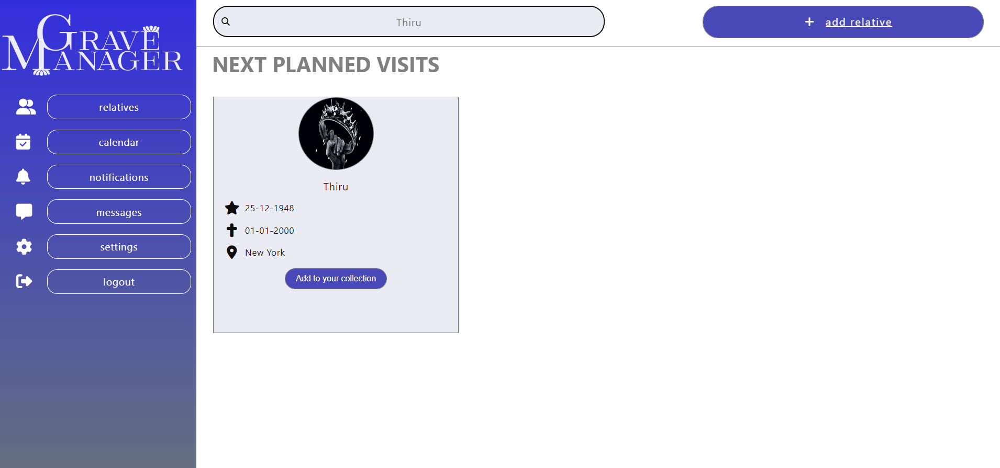
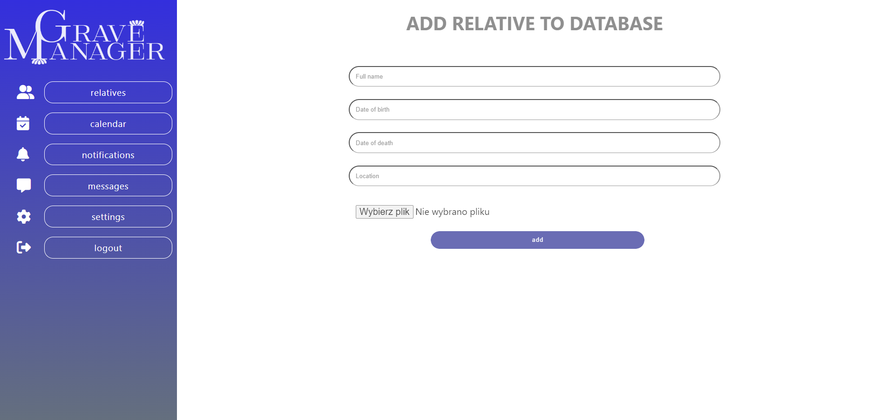
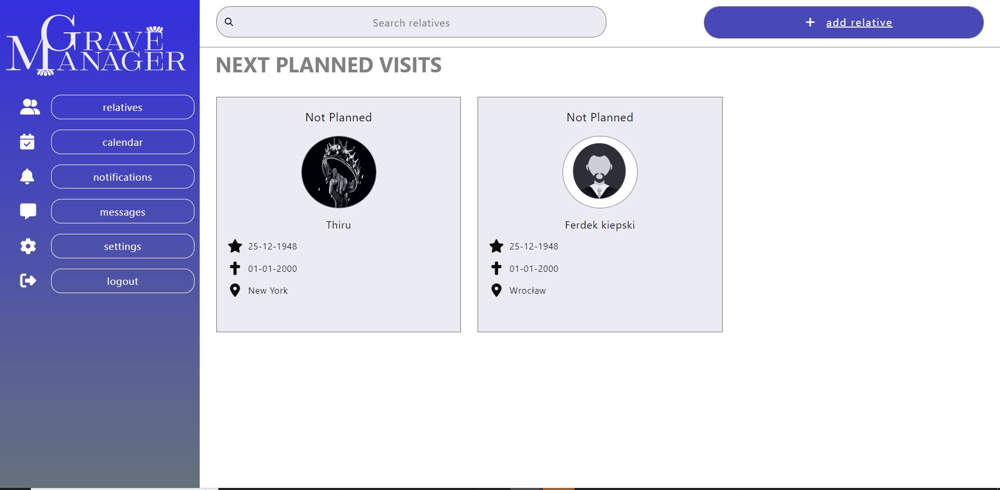

# grave-manager


## Overview
A simple app to manage the graves of loved ones.

## Technologies
* HTML
* CSS
* PHP
* NGINX
* JavaScript
* Docker
* PostgreSQL

## Features
* Responsive design for optimal user experience across devices
* Registration and login
* User session and logout
* Simple adding of new grave information to db
* Searching of the entire database and adding to a user's own collection
* Visit Planning

## Database

For now database is simpliefied.
Table which store user relative relation stores also information about visist of selected grave.
Further improvements include the introduction of a cemetery table and a cemetery administrator 
It will be second role which will handle adding of relative to db instead of regular user.


## UML Diagrams



## Local startup of server.
From root directory grave-manager run command:

```Shell
$ docker-compose up -d
```

To stop container
```Shell
$ docker-compose down
```

## Example of views from app

### Login


### Registration


### Searching


### Adding to db


### View of user relatives collection
